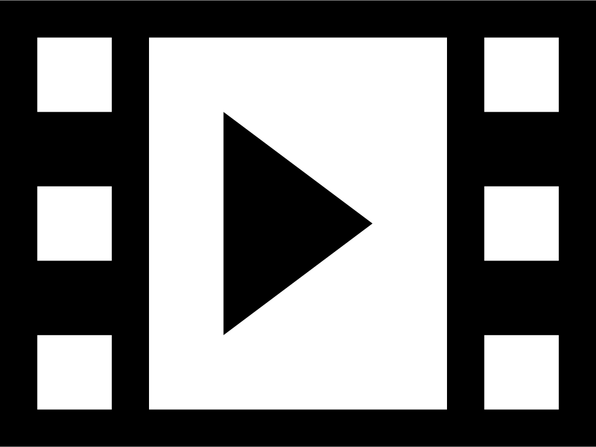

## Status
 
[](https://GitHub.com/Naereen/ama)
[](https://github.com/ellerbrock/open-source-badges/)

[](https://saythanks.io/to/kennethreitz)

## About

> This is **not for production use**.
> Feel free to install and try it out, but depend on it at your own risk.


## Preview
 
[](readme-media/ng-bootstrap-dashboard.mp4)


## Quick start
[Fork, Clone, or Download on GitHub](https://github.com/abbassizied/ng-bootstrap-dashboard)

```
cd project

npm install 

ng serve
```

Navigate to `http://localhost:4200/`. The app will automatically reload if you change any of the source files.

## Features
* Uses Angular 9 && ng-bootstrap plugin
* Toggleable side navigation
 
## Built With

* [Angular 9](https://angular.io/)
* [Bootstrap 4](https://getbootstrap.com/)
* [ng-bootstrap](https://ng-bootstrap.github.io/#/home)
* [angular-fontawesome](https://github.com/FortAwesome/angular-fontawesome)

## Author
Abbassi Zied

## Copyright and License

<a rel="license" href="http://creativecommons.org/licenses/by/4.0/"></a><br />This work is licensed under a <a rel="license" href="http://creativecommons.org/licenses/by/4.0/">Creative Commons Attribution 4.0 International License</a>.

